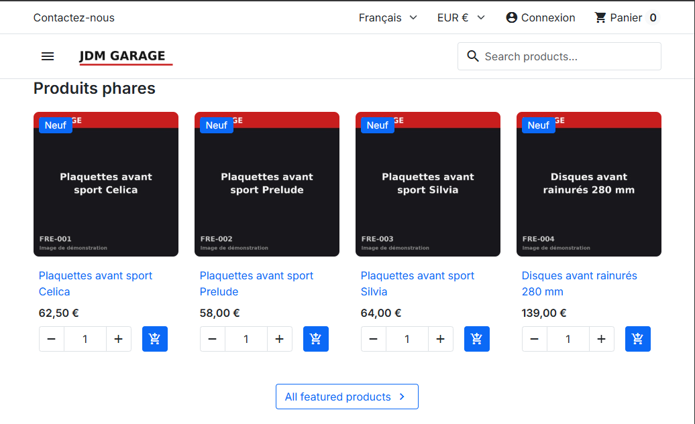

# 🏎️ JDM Garage : Pipeline d'importation intelligent pour PrestaShop



 ## 🎯 L'objectif
 Ce projet est un pipeline ETL (Extract, Transform, Load) conçu pour résoudre un problème classique de l'e-commerce automobile : la gestion complexe des compatibilités entre pièces, moteurs et véhicules.
 L'outil transforme des données brutes (CSV) en une boutique PrestaShop structurée, en garantissant l'intégrité des données avant toute injection en base.

 ## ⚙️ Architecture & Logique de données
 Le moteur repose sur une validation croisée de trois sources de données : Véhicules, Moteurs et Pièces.

 ### La logique de compatibilité
 Plutôt que de lier manuellement chaque pièce, nous utilisons un système de mapping flexible via la colonne compat du fichier parts.csv :
 - ALL : Pièce universelle (ex: essuie-glace).
 - VEH:CEL : Compatible avec tous les moteurs du véhicule Celica.
 - ENG:CEL-3SGTE : Compatibilité ultra-précise sur un moteur spécifique.

 L'algorithme traite les combinaisons par le symbole | pour permettre des règles multi-critères.

 ## 🚀 Workflow de démarrage rapide
 Pour passer d'un dépôt vide à une boutique prête pour le test, une seule commande suffit :

 bash  pip install -r requirements.txt  python bootstrap.py --reset  

 Ce que fait le bootstrap :
 1. Docker : Sping up de l'environnement (PrestaShop + DB).
 2. Provisioning : Création automatique de la clé API PrestaShop et injection dans le .env.
 3. Data Sanitization : Nettoyage de l'instance et application des paramètres d'identité (SHOP_*).
 4. Ingestion : Importation des données, gestion de la TVA (20%) et sécurisation des droits API.

 Note : Le script est idempotent. Vous pouvez le relancer sans risque de doublons grâce au flag --skip-install.

 ## 🛠️ Boîte à outils (Scripts utiles)

 ### Gestion des Assets (Images & Design)
 Le script shop_assets.py automatise l'aspect visuel pour éviter une configuration manuelle fastidieuse :
 - python shop_assets.py : Génère le logo, les images produits et configure la page d'accueil.
 - python shop_assets.py --list-home : Vérifie quels modules sont actifs sur la home.
 - Note : Si aucune photo n'est présente dans photos/, un placeholder est généré par défaut.

 ### Importation de données
 Le processus est divisé en deux temps pour garantir la qualité :
 1. Dry Run : python import_catalog.py génère un rapport de cohérence (reports/rapport_compatibilite.md).
 2. Live Import : python import_catalog.py --import injecte les données une fois validées.

 ## 🔧 Configuration & Environnement
 Le projet utilise un fichier .env pour séparer le code de la configuration sensible.

```
 bash  cp .env.example .env  
 ```
 Variables clés : DB_PASSWD, ADMIN_*, PS_PORT, et les variables de branding SHOP_*.
 Attention : Le fichier .env est ignoré par Git. Ne partagez jamais vos accès.

 ## 🔍 Expérience Utilisateur (Frontend)
 Le catalogue est optimisé pour la recherche via le module Faceted Search de PrestaShop.
 Une fois l'import terminé, le client peut filtrer instantanément le catalogue par :
 - Véhicule
 - Moteur
 - Marque

 ## 🚧 Roadmap & Limites connues
 - Limitations actuelles : Pas de mise à jour automatique des stocks/prix existants (l'import est conçu pour l'initialisation).
 - Améliorations prévues : Implémentation d'un sélecteur de véhicule natif en frontend et gestion dynamique de l'affichage "Compatible / À vérifier".

 ---
 💡 Disclaimer : Toutes les données utilisées dans ce démo sont fictives. Elles ne doivent en aucun cas être utilisées pour des applications réelles.

🤖 Rapport assisté par Luvix_ Bot Alpha3